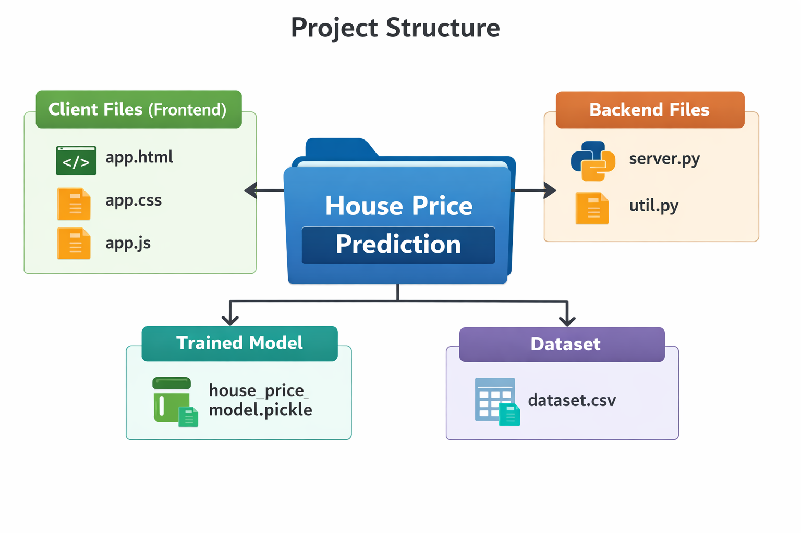
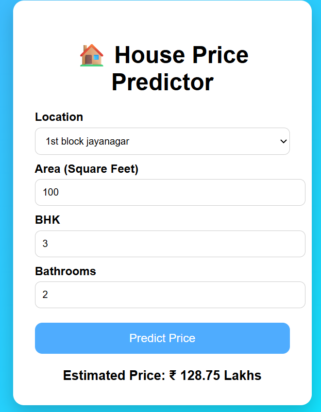

# 🏠 House Price Prediction Web App

A full-stack Machine Learning web application that predicts house prices based on user inputs like location, square footage, BHK, and number of bathrooms. Built with a powerful combination of Python (Flask) for backend and a clean HTML/CSS/JavaScript frontend.  

## 🚀 Project Overview

This project demonstrates how a machine learning model can be deployed as a real-world web application. Instead of just training a model in a notebook, this system allows users to interact with it through a simple and intuitive UI.  

### Users can:
1. Enter property details
2. Select location
3. Get instant price predictions  

   
## 🧠 Machine Learning Model
Algorithm Used: Linear Regression
Dataset: Real estate housing dataset  

### Preprocessing:
Handling missing values
One-hot encoding for locations
Feature scaling (if applied)
Model Serialization: pickle  

## 🛠️ Tech Stack
Python 
Flask 
NumPy 
Scikit-Learn 
Pickle 
HTML 
CSS 
JavaScript 
VS Code 
Jupyter Notebook / Google Colab  

## 📂 Project Structure

  

## ⚙️ Features

✅ Predict house prices instantly 
✅ Clean and responsive UI 
✅ Dynamic location dropdown 
✅ REST API integration 
✅ Lightweight and fast  

## 🔌 How It Works
User enters:
Location 
Square feet 
BHK 
Bathrooms 
Frontend sends data to Flask API 
Backend processes input using trained model 
Predicted price is returned and displayed  

## 🧪 Sample Inputs for Demo
You can use these while showcasing your project:
 

Location	         Sqft	   BHK	  Bath   Expected Output 
Whitefield	      1200	    2     	2    	Moderate price 
Indiranagar	      2000   	 3	      3	   High price 
Electronic City 	900	    2	      1	   Lower price 
Yelahanka         1500	    3	      2   	Mid-high 
Hebbal	         1800	    3	      3	   Premium 
  

## ▶️ Running the Project
1. Clone the Repository:
git clone https://github.com/your-username/house-price-prediction.git

cd house-price-prediction

3. Install Dependencies:
pip install flask numpy
4. Run the Server:
python server/server.py
5. Open Frontend:
Simply open app.html in your browser
  

## 🌐 API Endpoint
POST /predict_home_price 
Parameters:
location 
total_sqft 
bhk 
bath 
  

## 🎯 Future Improvements
📊 Add advanced ML models (Random Forest, XGBoost) 
🌍 Deploy on cloud (AWS / Render / Vercel) 
📱 Make mobile responsive UI 
📈 Add price trend visualization 
🔐 User authentication system 
  

## 📸 Screenshot of the project

  

## 🙌 Acknowledgements
Dataset inspiration from real estate listings 
Flask documentation 
  

## 📌 Conclusion
This project bridges the gap between Machine Learning and Web Development, making models usable in real-world scenarios. It’s a strong portfolio project showcasing both data science and full-stack skills.
